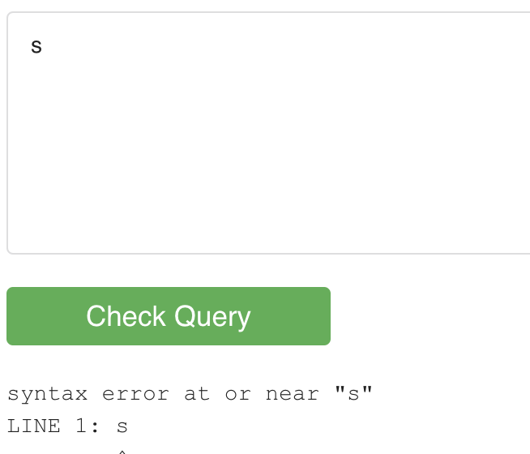
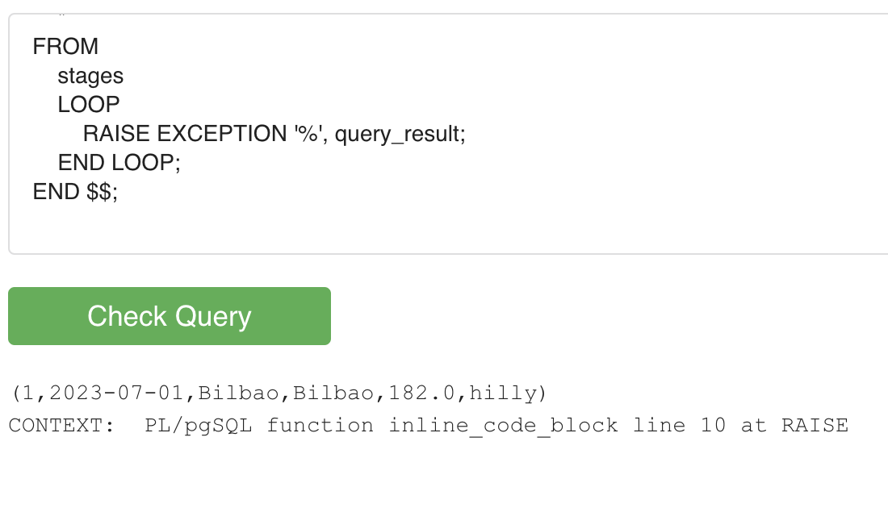

## Introduction

I'm currently taking a module called CS2102 (Database Systems) where we get to learn about how databases are designed, and how do we make us of queries and their keywords to the fullest. This module legitimately feels like it's on steroids, compared to the (tamer) one that I took in polytechnic. Anyway, There's an assignment that we have to finish where we create SQL queries based on the question (e.g what's the biggest X, how many Y, etc), and there's also a website where we can run our queries to check.


Basically, whenever a query is ran, the site runs your query's result set against their correct result set and let's you know whether you're missing rows, columns and if the values/data types are all correct.

## Liberal Errors?

Cut to me writing sloppy SQL queries that aren't even synctactically correct, _and I got this error_.



Right below is an error message in all its glory with no formatting. This definitely made me confused as whenever a query was successfully ran, its results would not be shown, but rather the correctness of the result is shown instead. Yet, here is an error message that's not abstracted at all and shown without any formatting.

So the next thing I thought was, could I print out my result set of a query through an error?

## Satisfaction

The answer was.. yes! With some help from ChatGPT, I managed to quickly create a code snippet that would return the first row of a query result set as an error message.

```sql
DO $$
DECLARE
    query_result RECORD;
BEGIN
    FOR query_result IN SELECT
    *
FROM
    stages
    LOOP
        RAISE EXCEPTION '%', query_result;
    END LOOP;
END $$;
```

Here is the working exploit!



It is pretty trivial to write some code to dump out the database records (by checking `information_schema` to find the columns and tables) and we can further build on the previous snippet to concatenate the rows into a string delimited by `\n` to get the entire table's content. Of course, I didn't do it (..or did I?) and just reported it 🤐🧐

## Conclusion

Well I guess one way to fix this mistake is to identify your errors and differentiate between parsing errors and other type of errors (manual thrown errors). Or you know, maybe you could just not print out error messages in its entirety back to the user.

**Fun hack!**
